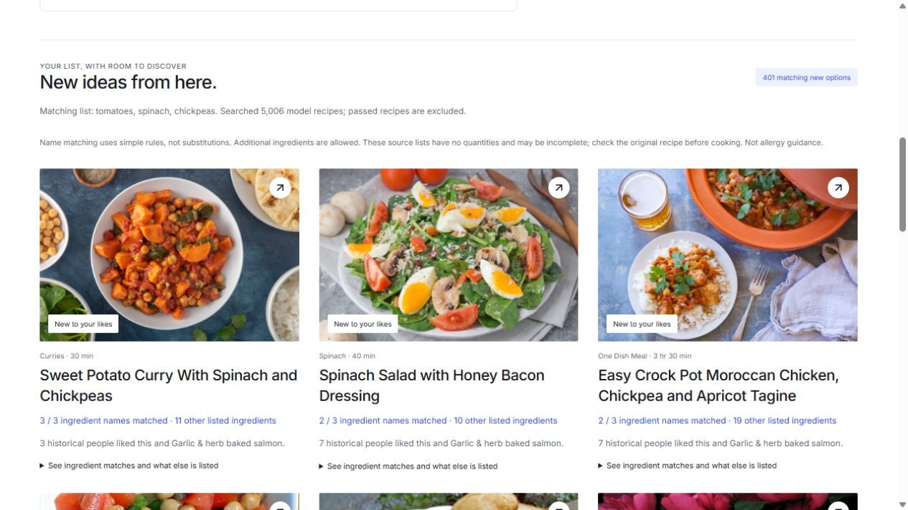

# Demo 01: readiness and rehearsal

Completed October 3, 2026 under the approved demo-readiness scope. No app UI, serving algorithm, dependency, dataset, model weight, frozen implementation/protocol or final-test result was changed. MealMerge trade-off review remains deferred. This pass adds a read-only preflight command, four fixture tests, browser QA evidence and a [rehearsal/recovery guide](DEMO_GUIDE.md).

## What was checked

Production browser verification used **http://localhost:4173**, initially showing no opinions or favorites, separate from the normal **http://127.0.0.1:5173** profile. The test profile liked Greek salad, garlic/herb baked salmon and Egyptian red lentil soup; passed stovetop macaroni/cheese; and saved Bourbon Chicken. `QA Guest` liked stovetop macaroni/cheese and quick chicken curry, and passed Greek salad. These are explicitly synthetic QA fixtures, not the user's preferences, historical test people or a quality benchmark. The original user profile/guests were not read, overwritten, reset or reassigned. QA data remain in that separate browser origin; the temporary tab was closed afterward.

| Check | Observed result |
| --- | --- |
| Cold local startup | Ports 8000, 5173 and 4173 were not serving at the outset. `npm run dev:all` printed both Vite and 5,006-recipe model readiness. |
| Combined shutdown | Ctrl+C stopped the launcher; a listener/process check found neither its 5173 nor its 8000 port still occupied. Later verification used separate model/Vite/production-preview terminals to isolate outages. |
| Onboarding draft cancellation | A draft Greek-salad like disappeared when reopening after cancellation; Discover stayed non-personalized. |
| Apply and refresh | Three likes/one pass applied and survived reload. Discover reported three explicit likes and real shared-like evidence. |
| Favorites | Bourbon Chicken saved through its dialog, survived reload, and appeared in Saved independently of personal likes. |
| Your Tasteprint | Shows 3 liked, 1 passed, 1 saved; the reviewed likes have evidence-backed sensory estimates and truthful uncertainty labels. Guest editing did not change these counts. |
| Bulk recipe details | Bourbon Chicken loaded aligned source instructions, original source/dataset links and quantity/safety caveats. Missing-photo Flank Steak with Lime-Chipotle Sauce also loaded real instructions. Escape closed its dialog. |
| Ingredients | Pending comma-separated tomatoes/spinach/chickpeas submit correctly. Balanced shows 401 new options and the known Greek salad separately for this QA profile. |
| Priorities | All three modes return actual results. Ingredients-first changes secondary choices; taste-first leads with different supported dishes. This verifies behavior, not that one priority is preferable. |
| Explainable matches | The first balanced option, Sweet Potato Curry with Spinach and Chickpeas, shows all three source matches plus 11 other ingredients; expanding reveals diced tomatoes, fresh spinach and chickpeas. |
| Stale/empty results | Removing spinach clears previous results pending another submission. Nonsense-name search shows a real empty Discover state; an unmatched ingredient list gives zero matches without samples. |
| Guest isolation/persistence | Guest name and two likes/one pass survived refresh. Personal counts stayed unchanged. |
| Shared options | The default group request returns 5,004 eligible recipes, excludes the two passed recipes, and shows both people's evidence. Per-person view renders the corresponding source connections/positions. No policy redesign or human satisfaction review was done. |
| Controlled model outage | Stopped only the model process launched for this check, leaving the preview running. Discover explicitly switches to catalog order. Bulk directions show an unavailable message/retry/source link. Ingredients and MealMerge show explicit failure and no sample substitute. Saved choices/guests remain visible. |
| Recovery | Restarted the same frozen model. MealMerge's Try again restores real results; returning to Discover restores personalized ordering. Reopening Bourbon Chicken restores source directions. Direction-specific and ingredient-specific retry-after-restart were not separately exercised in the browser; the recorded check does not imply every retry path was manually tested. |
| Missing photo | Actual catalog record `foodcom:4684` has no photo. Its card and details show Photo unavailable while metadata/directions remain usable. This checks absent-photo behavior, not a forced CDN/network failure or every URL. |
| Layout | Browser viewport 1280×720; Ingredients has no horizontal overflow and visible cards/evidence. No comprehensive new 1440/narrow-device or animation review is claimed. |

No external recipe/dataset form was submitted or source file uploaded. Photos load remotely through the existing app; offline image caching is still outside scope.

## Preflight added

`scripts/check_demo.py` uses only the standard library and existing app metadata. It allows only local app origins on 5173/4173, checks six existing endpoints/flows with bounded requests and fails nonzero on an unavailable or invalid result. It verifies unique source recipe IDs and exclusions, real model methods, ingredient new options, two-person group evidence and aligned bulk instructions. A successful check is printed only after its assertions pass. It has no training, browser-storage writes, historical-user input, final-test scoring or new HTTP routes.

Run from the project folder after app/model readiness:

```powershell
.\.venv\Scripts\python.exe scripts/check_demo.py
# Or, with the built preview already running:
.\.venv\Scripts\python.exe scripts/check_demo.py --base-url http://127.0.0.1:4173
```

Both origins passed all six checks. QA requests report 4,999 unseen Discover options, 402 ingredient matches and 5,004 group-eligible recipes for the preflight's separate six-like fixture, not the browser's three-like fixture. This measures availability/contracts, not model-quality improvement, stress capacity or rendering.

## Verification and a transient timeout

- Production build passes. The existing large main-chunk warning remains: 5,193.44 kB, gzip 786.46 kB. No bundle redesign was made before the deadline.
- Normal frontend suite: 66 passed, two opt-in live checks skipped.
- Initial live-enabled run: the two API checks timed out at their existing 10-second request bounds; the other 66 passed. This is retained, not hidden.
- Bounded health probes afterward passed directly on 8000 and through both 4173/5173 proxies in 0.018–0.054 seconds. The isolated two-test rerun passed, then the complete live-enabled run passed **68/68**. Preflight passed both development and preview origins. No permanent timeout cause was established; no speculative fix, relaxed timeout or retry loop was applied.
- The diagnosing-bugs skill guided isolating the live checks and comparing direct/proxied requests. A deterministic recurrence could not be obtained, so the cause remains unresolved. A new failure should be captured before changing serving code.
- Full Python suite: **100 passed**, comprising the previous 96 checks and four new preflight fixtures. No skips.
- ML 05 receipt still verifies, including all frozen code and predecessor hashes; no test rescoring occurred.
- Browser checks use the computer-use skill's observed-page workflow and separate QA origin. They are additional to, not replaced by, static/hook tests.

## Screenshots

These depict the synthetic QA profile, not the user's personal recommendations. Current source photos can change/fail; screenshots are evidence of this local run, not bundled app assets.



Additional evidence: [per-person group view](qa/demo01/group-evidence.jpg), [bulk directions during model outage](qa/demo01/model-outage.jpg), [actual missing-photo card](qa/demo01/missing-photo.jpg).

## Handoff and limits

Keep the model unchanged. The usual development app/model were left running on 127.0.0.1:5173 and 8000; the temporary production-preview process and QA tab were closed. Follow [the startup/recovery guide](DEMO_GUIDE.md) before the October 4 demo, keeping one stable origin for the actual profile. The exact competition submission cutoff and presentation requirements remain unsupplied.

Next proposal: the user rehearses with their actual preferences and identifies any awkward transition or last small polish. This report does not approve more features, public hosting, new model work or MealMerge trade-off analysis. Persistent timeouts, if encountered, need renewed diagnosis; a passing warm run is not a guarantee of future availability.
