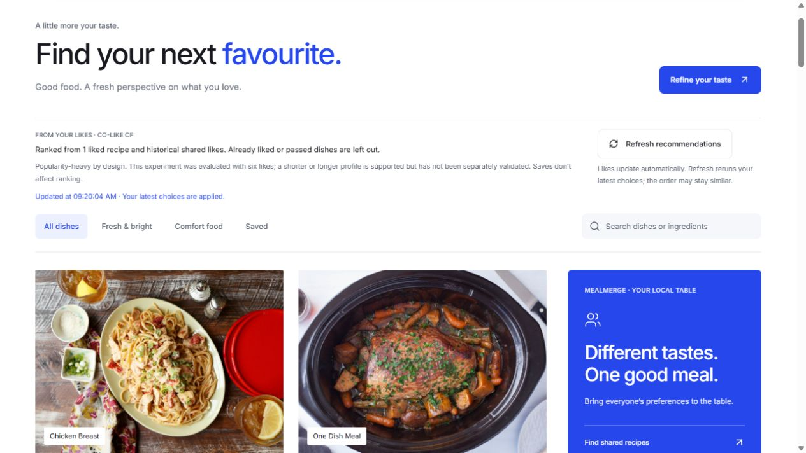

# Discover refresh — October 4

Approved request: add an explicit refresh action because Discover's All dishes view appears unchanged after new likes. No model, catalog, backend, historical evaluation or preference-storage change.

## Outcome

Discover now has an always-visible secondary **Refresh recommendations** button above its filters. It reruns the current likes/passes, shows a disabled Refreshing state while the request is pending, then displays the successful local completion time. Search and filter selections are preserved; the visible batch resets to 24. Automatic updates remain enabled. Repeated choices can yield the same order, and saving is not liking.

The hook identifies responses by both choice key and refresh attempt. A new attempt immediately hides the previous result and its completion time, even for identical choices. Existing cancellation, response validation, exclusions, no-evidence fallback and error/retry behavior remain in place. This is reranking, not retraining.

## Diagnosis and actual checks

- Before implementation, `npm test -- src/lib/useRecommendations.test.ts src/components/discover-render.test.tsx` ran seven passing checks and two expected failures: the requested control did not exist, and a same-profile retry initially returned the prior ready state in the hook harness. Automatic new-like requests and All dishes response ordering passed before the change. This did not establish an automatic-reranking defect.
- The initial sandbox test launch failed with Vite `spawn EPERM`; the authorized outside-sandbox run produced the test results above.
- Runtime inspection found the web app reachable on 5173 while the Python model on 8000 refused connections. A separate `http://localhost:5173/#discover` browser profile visibly showed **Recommendations are unavailable** and catalog order. This explains the observed local unavailable state, not necessarily every earlier instance reported by the user.
- Started the existing service with `npm run dev:model`. The new Refresh button recovered the page to popularity results and displayed a completion time without a page reload.
- In the separate QA profile, liked Bourbon Chicken through its actual recipe dialog. Automatic reranking visibly switched to **Ranked from 1 liked recipe**, excluded Bourbon Chicken, and moved Creamy Cajun Chicken Pasta to the first slot. This checked a real app interaction, not just a mock response.
- Manual refresh of that same profile showed Refreshing, then a later successful timestamp. A subsequent filtered refresh preserved the Creamy Cajun Chicken Pasta search and returned that recipe. Cleared the QA search and selected All dishes for the screenshot.
- The user's 127.0.0.1 browser profile was not read or modified. The separate localhost QA profile retains its one test like; no preferences were cleared. The temporary QA tab is closed at handoff. The restored Python service is left running alongside the already-running web app.
- Focused tests: **9/9 passed** after implementation. Full frontend suite: **72 passed, two live checks skipped** normally; opt-in live run: **74/74 passed**. Production build passes, with the existing large-catalog chunk warning (main bundle approximately 5.195 MB).
- `scripts/check_demo.py`: **all six checks passed**, including the model through Vite and actual individual/ingredient/group results. It does not persist request fixtures.
- `scripts/run_final_evaluation.py verify` confirmed the completed final receipt and unchanged model/evaluation predecessors without rescoring.

The controlled checks reproduce service unavailability and confirm recovery, but do not show a remaining automatic-update bug with the model running. No speculative model or ranking change was made. The hook harness is not a substitute for React DOM/browser testing; the interactive checks above supply separate evidence.

## User handoff

Reload the browser once if the new button is not yet visible. Open Discover, Like a recipe in its details, close the dialog, and use **Refresh recommendations** above All dishes. Look for the completion time and current liked-recipe count. Clear any search to inspect the full ranking. Future startup should use `npm run dev:all` to start both the website and model; a web-only `npm run dev` cannot provide model recommendations on its own.

No next feature is automatically approved. Catalog expansion and MealMerge trade-off review remain separate discussions.

