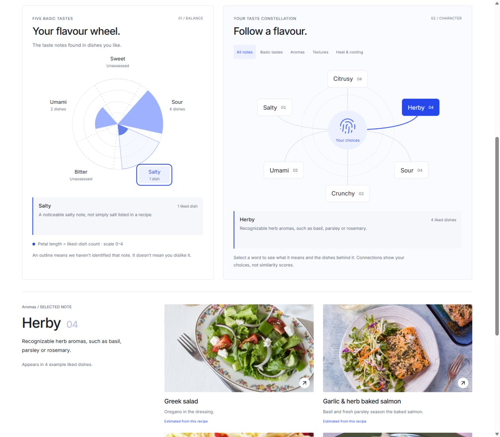
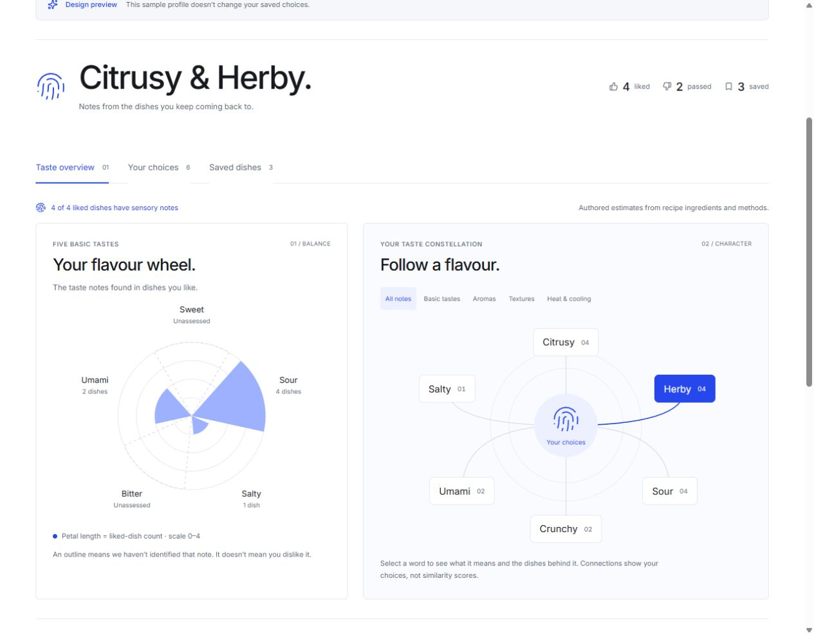

# UI 04: sensory Tasteprint graphics

Completed October 1, 2026, within the approved sensory Tasteprint scope.

Your Tasteprint now pairs a five-basic-taste wheel with an interactive vocabulary constellation. Compact liked/passed/saved counts support a word-led profile heading. Your choices and Saved dishes remain available through their existing tabs.

## What the graphics mean

The wheel has fixed Sweet, Sour, Salty, Bitter and Umami axes. Petal radius represents the count of explicitly liked recipes with that estimated note, on a shared scale from zero to the number of liked dishes. This is a descriptive count, not measured intensity, preference probability or a recommendation score. A dashed outline means unassessed; absence of an annotation does not establish absence of the sensation or dislike.

The constellation explores the accepted 18-term vocabulary, with filters for basic tastes, aromas, textures, and heat/cooling. Selecting a word or wheel label reveals its definition and the specific liked recipes behind it. The same selected word drives both graphics and the evidence panel. Lines connect notes to the profile; their placement is compositional, not a computed similarity map. The glossary exposes every definition, including unassessed notes.

`sensory-v1` contains positive annotations authored from the ingredients and instructions of the 30 manually reviewed recipes. Each note has a recipe-specific reason. These are metadata estimates, not tasting measurements or trained classifications. The bulk catalog remains unassessed. Salt ingredients and broad source categories such as Savory do not automatically become Salty or Umami. Only explicit likes contribute; passes and saves do not.

## Interaction and motion

Motion draws constellation connections and animates selection/hover feedback. A restrained adaptation of React Bits Tilted Card wraps supporting recipe photographs, with keyboard focus feedback and a static touch behavior. Recipe buttons retain the normal source-detail dialog; example mode uses read-only dialogs and does not copy sample preferences into the user's profile. No dependency, storage schema, recommendation model, or ranking behavior changed.

The two graphics stack on narrow screens; the constellation becomes a compact button grid. Existing system motion preferences are respected without adding a visible motion setting. Provenance and adaptation details are recorded in `THIRD_PARTY_NOTICES.md`.

## Verification and limits

- TypeScript and the production Vite build pass.
- Frontend tests: 66 passed, two existing opt-in live-backend tests skipped. New tests cover dictionary and evidence integrity, only-likes aggregation, unknown/bulk states, and empty/example rendering.
- Browser review covered the empty and example profiles, wheel/constellation selection, vocabulary filtering, glossary expansion, keyboard selection and read-only sample recipe details. At a 360px viewport the document and expanded glossary had no horizontal overflow. Desktop graphics were reviewed at 1280px. Temporary viewport overrides were reset.
- Browser verification used the production preview at `http://127.0.0.1:5174/#tasteprint`. The existing 5173 development page appeared blank in the in-app browser during this review; successful production verification does not resolve that development-preview issue. Its existing server was left running.
- Vite reports the existing large catalog bundle warning. Catalog delivery/performance remains a separate scope.

## October 1 interaction refinement

The user requested more diagram animations and hovers after reviewing UI 04. Wheel sectors now have stationary, full-sector pointer targets, including small and unassessed petals. The visual sector lifts a few pixels on hover/focus while its count-encoded radius stays unchanged. Its label and outline highlight, and a local definition preview follows exploration. Click selection remains separate and still commits the recipe evidence below.

Constellation nodes lift/scale on hover/focus, compress on press, and highlight their corresponding connection. Under normal motion preferences a short travelling dot follows that connection and a single ripple expands from the center. These effects do not loop. Native keyboard focus exposes the same definitions, and group changes clear transient exploration. Evidence now has a brief outgoing transition as the selected word changes.

Verification: build and all 66 frontend tests pass; two existing live-backend tests remain skipped. Browser pointer exploration of the outer Salty sector displayed its definition while evidence stayed Sour; clicking the same area committed Salty. Hovering Herby then left Salty evidence selected. Keyboard focus previewed Bitter without changing Sour selection; Enter committed a word. Unassessed Sweet retained its unknown explanation. A 360px viewport had no horizontal overflow. The browser reports system reduced motion, so moving lift/dot/ripple effects were code-checked but their normal-motion choreography was not visually verified in this session; static hover/focus/selection feedback was verified. Temporary viewport overrides were reset.

## Review the next iteration

Open the production preview and choose Explore an example to see varied petal sizes without changing real preferences. Judge the relative prominence of the wheel and constellation, then the strength of the motion. Further visual refinements and any new data/model inference are proposals to discuss.

