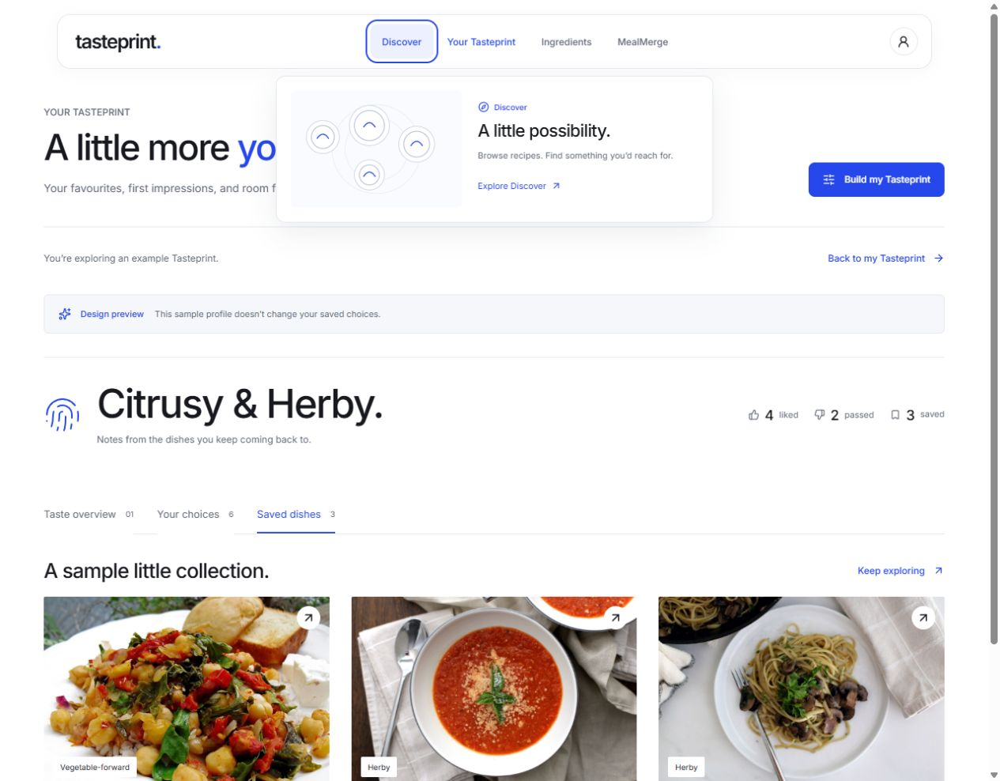

# UI 05: app navigation motion

Completed October 1, 2026. The user selected Travelling highlight with page arrival sequencing, gliding Tasteprint view tabs and responsive navigation tiles (options 1, 2 and 4). Recipe-card expansion remains a later proposal.

## Navigation behavior

The app has a compact floating navbar inspired by the inspected [AccessGrid navigation](https://accessgrid.com/). Direct Discover, Your Tasteprint, Ingredients and MealMerge links keep the native hash routes. A shared highlight travels to the hovered/focused destination and returns to the current route after exploration ends.

Hover or keyboard focus opens a short destination preview with an original line illustration: recipe plates, a taste constellation, ingredients leading to a plate, or people converging on a shared meal. The graphics describe destinations rather than claim personal/model evidence. Each preview contains a working destination link. A short pointer-leave delay allows crossing the gap into the preview. Escape dismisses it; from the preview link, Escape returns focus to the corresponding top-nav link. Leaving focus, leaving the navbar or navigating closes the preview. Narrow/touch layouts retain direct links and omit the illustration panel.

Page arrivals introduce headings first, supporting controls next and the main content shortly afterward. Navigation remains immediate, with no outgoing-page wait or scroll locking. Existing page-local reset behavior remains intact.

Your Tasteprint's Overview, Your choices and Saved dishes share a gliding indicator and a brief content arrival. Switching these views retains the example/real-profile mode and choice filter. Existing source details and sample isolation remain intact. The Discover MealMerge tile lifts with an entering accent and advancing arrow; related Tasteprint/Ingredients links have hover/focus arrow and underline feedback.

## Motion policy and boundaries

After being told the review browser requests reduced motion, the user explicitly chose **Always show the navigation animations**. The navbar and local view indicator use scoped Motion overrides; navigation arrival/tile CSS stays active. This policy does not replace the sensory diagram or onboarding motion policy. There is no new setting, dependency, storage schema or backend/model change. Motion and original SVG/CSS are reused; no AccessGrid assets or code were copied.

## Verification

- Production build/TypeScript pass. All 66 active frontend tests pass; two existing opt-in live backend checks remain skipped. The existing static-render test's minimal window stub now supports the resize listener required by Motion's shared layout indicator.
- Browser checks covered all four destinations, direct/preview links, changing destination graphics, Escape dismissal and focus return. Moving highlight transforms and preview entrance styles were observed despite the browser reporting reduced motion. Page/view CSS animations remain active under that preference.
- Example choices showed all six records; filtering to Not for me showed two. Saved showed three real source recipes. Returning to choices retained the pass filter. Main navigation reset the temporary example as before; sample data did not become personal preferences.
- Discover rendered its bounded 24 initial cards, and Greek salad opened with the normal opinion/save controls and source information. No recipe opinions, saves or guest edits were made during this review. The production preview truthfully showed catalog browsing when its model service was unavailable; live recommendation behavior was not revalidated in this UI milestone.
- Keyboard focus activated the MealMerge tile's lift/arrow feedback; Enter opened MealMerge. At a 360px viewport, direct navbar navigation and Ingredients had no horizontal overflow (345px document client and scroll widths). Desktop layout was checked at 1280px. Temporary viewport overrides were reset.
- The existing large catalog bundle warning remains. Browser review used the built preview at `http://127.0.0.1:5174/#tasteprint`; the unrelated earlier 5173 development-preview issue was not changed.

## User review

Hover across the four top-nav destinations, try their links and Escape, then explore an example Tasteprint and switch its three views. Review the preview panel's size and the pace of movement before deciding on further motion or recipe-card expansion.
